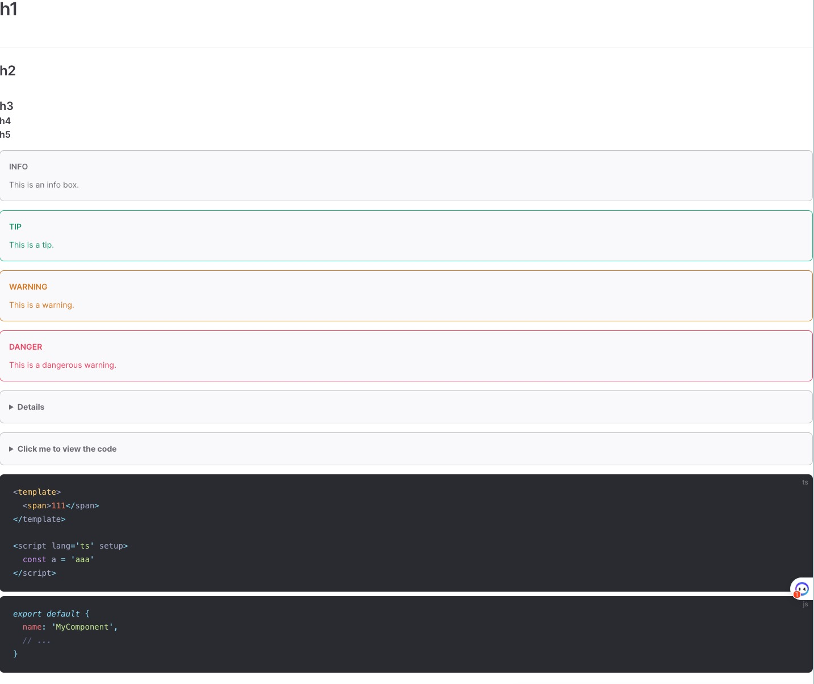

# vite-plugin-vitepress-markdown

## 功能简介
将markdown文件转为vue组件。

## 安装
```bash
npm install vite-plugin-vitepress-markdown -D
```

## 依赖
- vite
- vitepress

## 使用方式
### 插件
```ts
import { VitePluginVitePressMarkdown } from 'vite-plugin-vitepress-markdown'

// https://vitejs.dev/config/
export default defineConfig({
  plugins: [VitePluginVitePressMarkdown(), vue({
    include: [/\.vue$/, /\.md$/],
  })],
})
```

```ts 
<script setup lang="ts">
import TestVue from './test.md'
</script>

<template>
  <TestVue />
</template>

<style scoped></style>
```

### 手动解析
```ts
import { Parser } from 'vite-plugin-vitepress-markdown'
import { resolve } from 'path'
import testCode from './fixture/test.md?raw'

const srcDir = resolve(__dirname, './markdown')

const parser = new Parser({
  root: srcDir,
  base: '/',
} as any, {})

await parser.setupRender()
const source = await parser.transform(testCode, resolve(srcDir, 'test.md'))
```

## 效果

